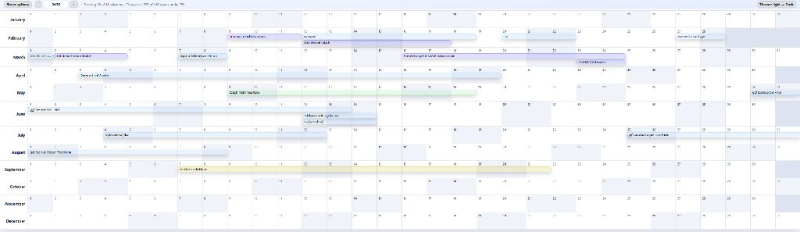
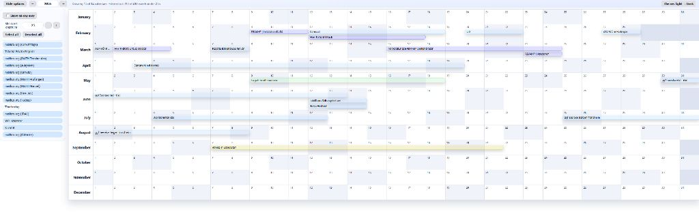
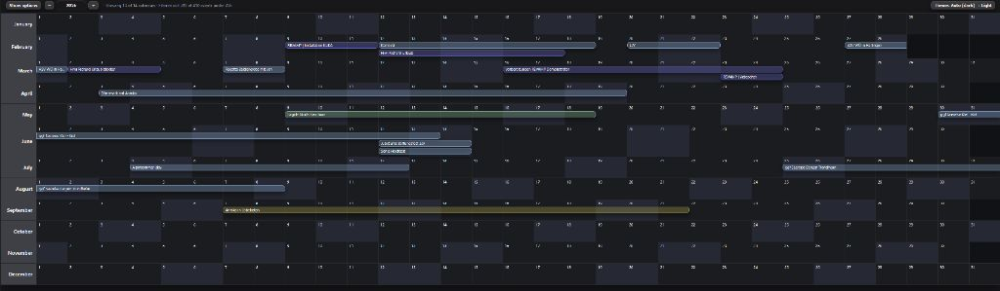
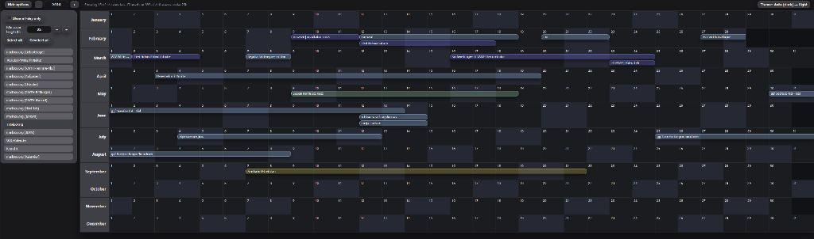

# Thunderbird Annual View
Calendar Annual View is a Thunderbird add-on that shows an entire year in one compact, readable grid.
It displays all 12 months, supports multiple calendars with automatic color matching, and keeps the view read-only for quick planning and overview use cases.

## Marketplace Description

Calendar Annual View adds a full-year calendar layout to Thunderbird: all 12 months are shown in one linear grid where each row is a month and each column is a weekday. It is designed for fast yearly planning and conflict spotting.

The add-on automatically detects your Thunderbird calendars, applies their configured colors, and lets you filter what is shown (per-calendar visibility, minimum event duration, and all-day events only). The annual view is intentionally read-only, so event editing remains in Thunderbird's standard day/week/month views.

## Features

- **Annual Grid View**: Displays all 12 months in a compact grid.
- **Multi-Calendar Support**: Show events from multiple calendars at once.
- **Automatic Calendar Detection**: Pulls calendars and colors from Thunderbird's settings.
- **Configurable Filters**:
  - Enable/disable specific calendars.
  - Filter events by duration (longer than X hours).
  - Filter to show only all-day events.
- **Theming**: Supports light and dark themes with appropriate icons.

## Screenshots

### Light Theme



### Dark Theme



## Installation

1. Download the latest `.xpi` file from the [Releases](https://github.com/BunteStadt/thunderbird_annual_view/releases) page.
2. In Thunderbird, go to **Add-ons and Themes** (Tools > Add-ons and Themes).
3. Click the gear icon and select **Install Add-on From File**.
4. Select the downloaded `.xpi` file and follow the prompts.

Alternatively, install directly from the [Thunderbird Add-ons site](https://addons.thunderbird.net/en-US/thunderbird/addon/calendar-annual-view/) using the ID: `GlamorousPotato.calendar-annual-view@addons.thunderbird.net`.

## Usage

1. After installation, new buttons (on the left in the spaces toolbar and at the top left) will appear.
2. Click a button to open the annual calendar view.
3. Select the year to display using the input field or the 2 buttons.
4. Click on `show options` to open the configuration tab.

## Configuration

Access the add-on options through Thunderbird's Add-ons Manager:

- **Calendars**: Select which calendars to include in the annual view.
- **Duration Filter**: Set a minimum event duration (in hours) to display.
- **All-Day Events Only**: Toggle to show only full-day events.
- **Week Numbers**: Toggle to show/hide ISO week numbers in the grid.

## Development

### Prerequisites

- Thunderbird 147.0 or later (up to 148.0).

### Building

To create an `.xpi` file manually:

1. Clone or download the repository.
2. Zip the contents (excluding the `.git` folder).
3. Rename the zip file extension to `.xpi`.

### Automated Smoke Test

Run the lightweight Node.js smoke tests for the year-view calendar service:

```bash
node --test
```

### Releasing a New Version

1. Create branches and commits as needed during development.
2. When ready for release, create a Git tag on the desired commit.
3. Push the tag to the repository (separate from pushing commits).
4. The GitHub Actions workflow will automatically create a new release and upload the `.xpi` file.

## License

This project is licensed under the Mozilla Public License Version 2.0. See the [LICENSE](LICENSE) file for details.

## Author

GlamorousPotato
