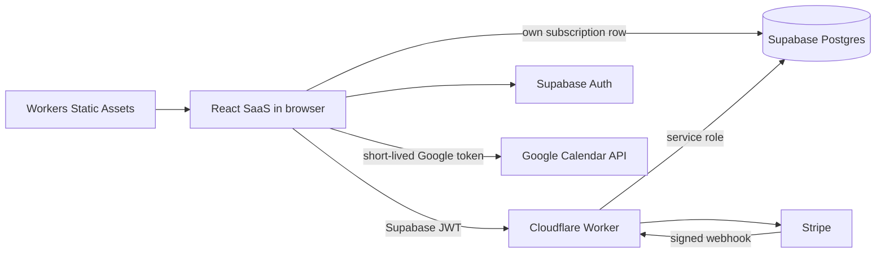

# SaaS architecture and implementation plan

## 1. Product scope

The SaaS host is a paid website for the existing Year View calendar. It adds
public product pages, Google login, monthly and annual subscriptions, account and
billing management, and subscription-gated Google Calendar access.

The first release has one product with two billing periods:

- EUR 2.00 per month
- EUR 12.00 per year
- VAT included
- no trial
- cancel at any time, effective at the end of the paid period

The Year View remains read-only. Calendar events are not copied into the SaaS
database. Additional login providers, teams, annual billing, coupons, analytics,
and an administration dashboard are outside this release.

## Current implementation state

As of 2026-08-06, the planned first-release application is implemented locally:

| Area | State |
| --- | --- |
| React, TypeScript, and Tailwind SaaS host | Implemented |
| Landing, pricing, login, account, checkout-return, and legal routes | Implemented |
| Supabase Google OAuth with Calendar read-only scope | Implemented; requires project configuration |
| Subscription schema and RLS migration | Implemented; must be applied to the target project |
| Stripe Checkout, Billing Portal, and signed webhook handling | Implemented; requires Stripe configuration |
| Active-subscription authorization | Implemented; only `active` grants access |
| Direct browser-to-Google Calendar access with subscription-gated app entry | Implemented |
| Shared Year View mounted through shared React/TypeScript/Tailwind core | Implemented |
| Unit, contract, type, build, and Worker bundle checks | Passing |
| Browser automation and live sandbox lifecycle test | Not yet implemented/run |
| Production deployment and legal completion | Not yet done |

The last verified local run passed all 70 repository tests, `typecheck:saas`, the
production SaaS build, and `wrangler deploy --dry-run`. This proves the local
code and Worker bundle are coherent. It does not prove external OAuth, database,
Stripe, tax, or webhook configuration.

## How to inspect the current state

Install dependencies once:

```sh
npm install
```

### Public UI without external services

This is the quickest way to inspect the landing, pricing, login, and legal UI:

```sh
cp .env.example .env.local
npm run dev:saas
```

Open the URL printed by Vite, normally `http://localhost:5173`. Placeholder
Supabase values are enough to view public pages, but Google login and account
flows will not work. Inspect `/`, `/pricing`, `/login`, `/privacy`, `/terms`,
`/cancellation`, and `/imprint`.

To inspect the optimized static build:

```sh
npm run build:saas
npm run preview:saas
```

### Full Worker, authentication, and billing flow

Create ignored local configuration files:

```sh
cp .env.example .env.local
cp .dev.vars.example .dev.vars
```

Replace every placeholder with values from a Supabase project and Stripe test
mode. Build and run the Worker on the port matching the example `APP_URL`:

```sh
npm run build:saas
npx wrangler dev --port 8787
```

Open `http://localhost:8787`. The independent health check at
`http://localhost:8787/api/health` should return `{"status":"ok"}`.

For a working end-to-end flow:

1. Apply `supabase/migrations/20260806210000_saas_billing.sql` through the
   Supabase SQL editor or CLI.
2. Enable Google in Supabase Auth and configure Google OAuth, the Calendar
   read-only scope, Site URL, and redirect allowlist. Include
   `http://localhost:8787/auth/callback` for local inspection.
3. Create a Stripe test Product with recurring EUR 2 monthly and EUR 12 yearly
   Prices, then set `STRIPE_PRICE_MONTHLY_ID` and `STRIPE_PRICE_ANNUAL_ID` in
   `.dev.vars`.
4. Configure Stripe Billing Portal and automatic tax for the test account.
5. Forward Stripe test webhooks locally:

```sh
stripe listen --forward-to http://localhost:8787/api/stripe/webhook
```

Copy the printed `whsec_...` value into `STRIPE_WEBHOOK_SECRET` in `.dev.vars`,
restart Wrangler, sign in, subscribe, and verify that `/checkout/success`
eventually opens `/app`.

### Verify the repository state

```sh
npm run typecheck:saas
node --test
npm run build:saas
npx wrangler deploy --dry-run
```

Expected current result: 70 tests pass, TypeScript and Vite succeed, and
Wrangler reads 13 static assets. Vite prints a non-fatal future config-loader
warning for ESM syntax in `vite.saas.config.ts`.

## What still needs to be done

Before accepting real payments:

1. Create and configure the production Supabase, Google OAuth, Stripe, and
   Cloudflare resources described above.
2. Apply the migration and verify RLS with real authenticated users.
3. Run the full Stripe sandbox lifecycle: purchase, webhook activation, Portal
   access, failed payment, cancellation, and access revocation.
4. Add browser automation for public pages, auth states, checkout return, paid
   calendar rendering, mobile layout, keyboard use, and overflow checks.
5. Verify Google provider-token expiry and reconnection in a real OAuth session.
6. Replace legal placeholders with the operator's real identity, tax, privacy,
   withdrawal, refund, and jurisdiction-specific terms.
7. Configure production Worker variables and secrets, deploy with
   `npm run deploy:saas`, and verify logs contain no tokens or calendar data.

No additional product features are required for the defined first release.

### Potential future improvements

- Replace repeated year-range event fetches with Google Calendar incremental
   synchronization using a per-calendar `syncToken`. Store the synchronized
   events and tokens in browser-local storage such as IndexedDB, handle expired
   tokens with a full resync, and apply the annual year filter locally.
- Load and render calendars independently so the Year View can display the
   first available results while larger calendars continue loading in the
   background. This would reduce the perceived delay for users with many
   calendars or recurring events.

## 2. Chosen stack

| Concern | Choice |
| --- | --- |
| SaaS UI | React, TypeScript, Vite, Tailwind CSS |
| Icons | Lucide React |
| Existing Year View | Reuse `src/core` React/Tailwind UI, renderer, and providers |
| Hosting | Cloudflare Workers Static Assets |
| Server endpoints | Cloudflare Worker `/api/*` routes |
| Identity | Supabase Auth with Google OAuth and PKCE |
| Entitlement database | Supabase Postgres with Row Level Security |
| Billing | Stripe Checkout, Billing Portal, and webhooks |
| Calendar source | Google Calendar API, read-only |

SaaS, the standalone web host, and the Thunderbird host all mount the shared
React/TypeScript core from `src/core/ui/annual-view.tsx`. Tailwind is compiled
in the core Vite build as well as the SaaS build. Provider, storage, and
calendar-engine contracts remain host-neutral; Thunderbird still supplies its
WebExtension adapters at the bootstrap boundary.

## 3. Runtime boundaries



The browser may contain only the Supabase URL, Supabase publishable key, and
other intentionally public configuration. Stripe secrets, the webhook secret,
and the Supabase service-role key exist only as Cloudflare Worker secrets.

The React route guard checks the current subscription before mounting the paid
calendar application. Worker API routes independently verify the Supabase JWT
and current subscription for billing actions. Google Calendar requests go
directly from the browser to Google after the token is issued.

Static JavaScript delivered by Cloudflare can always be downloaded. The paywall
therefore protects useful account data and the calendar API, not the existence
of the renderer source in a browser bundle.

## 4. Repository layout

```text
src/hosts/saas/
  index.html
  src/
      api.ts
      auth.ts
      env.ts
    main.tsx
      saas-google-provider.ts
      styles.css
      year-view.tsx
worker/
   index.ts
   shared/
   routes/
      stripe-checkout.ts
      stripe-portal.ts
      stripe-webhook.ts
supabase/
  migrations/
test/hosts/saas/
vite.saas.config.ts
wrangler.jsonc
```

The SaaS Vite build outputs `dist/saas`. Existing `build:web` and
`build:thunderbird` commands and output directories remain unchanged.

## 5. Routes

| Route | Access | Purpose |
| --- | --- | --- |
| `/` | Public | Product landing page |
| `/pricing` | Public | One-tier pricing and checkout entry |
| `/login` | Public | Google sign-in |
| `/auth/callback` | Public | Complete Supabase PKCE exchange |
| `/checkout/success` | Signed in | Wait for webhook-backed entitlement |
| `/checkout/cancel` | Signed in | Return from canceled Checkout |
| `/account` | Signed in | Identity, subscription, and billing actions |
| `/app` | Active subscription | Annual calendar view |
| `/privacy` | Public | Privacy and processor disclosure |
| `/terms` | Public | Service terms |
| `/imprint` | Public | Owner/contact details |
| `/cancellation` | Public | Cancellation and refund policy |

Return URLs accept only paths beginning with one `/`. Absolute URLs and
protocol-relative paths are rejected to prevent open redirects.

## 6. Authentication and Google consent

1. The user chooses **Continue with Google**.
2. The browser calls Supabase `signInWithOAuth` using PKCE.
3. The request includes only the Google email scope
   `https://www.googleapis.com/auth/userinfo.email` and the read-only Calendar
   scope `https://www.googleapis.com/auth/calendar.readonly`. It does not
   request the OpenID or Google profile scopes.
4. Google redirects through Supabase and then to `/auth/callback`.
5. The callback exchanges the code for a Supabase session and redirects to the
   validated local return path.
6. The browser uses the Google provider access token from the persisted Supabase
   browser session for calendar requests. The application does not copy it into
   the subscription database.

Google does not reliably return a provider refresh token on every login.
Although the OAuth request uses `access_type=offline` and `prompt=consent`, the
first release does not persist provider refresh tokens. When the provider token
expires or is missing, the UI asks the user to reconnect Google. Supabase access
and refresh tokens follow the normal Supabase browser session behavior.

## 7. Subscription data model

`public.subscriptions` is the application-visible entitlement mirror:

| Column | Purpose |
| --- | --- |
| `user_id uuid primary key` | References `auth.users(id)` |
| `stripe_customer_id text unique` | Stable billing customer mapping |
| `stripe_subscription_id text unique` | Current Stripe subscription |
| `stripe_price_id text` | Purchased server-controlled price |
| `status text` | Mirrored Stripe status |
| `current_period_end timestamptz` | Paid access boundary |
| `cancel_at_period_end boolean` | Pending period-end cancellation |
| `stripe_event_created_at timestamptz` | Reject stale event updates |
| `created_at`, `updated_at` | Audit timestamps |

`public.stripe_webhook_events` stores each processed Stripe event ID and event
creation time. Its unique event ID makes webhook retries idempotent.

Row Level Security rules:

- authenticated users may select only `user_id = auth.uid()`
- anonymous users cannot read subscription rows
- browser roles cannot insert, update, or delete billing state
- Worker API routes mutate billing rows with the service-role key
- the webhook ledger is not exposed through the public API schema

Only `active` grants access in version one. `incomplete`, `past_due`, `unpaid`,
`canceled`, `incomplete_expired`, and `paused` do not. A subscription scheduled
to cancel remains `active` until Stripe reaches the period end and sends the
terminal update.

## 8. Stripe lifecycle

### Checkout

`POST /api/stripe/checkout`:

1. Verify the Supabase bearer token and load the user.
2. Reuse the subscription row's Stripe customer or create one with the Supabase
   user ID in immutable metadata.
3. Create a hosted Checkout Session in `subscription` mode using only
   `STRIPE_PRICE_MONTHLY_ID` or `STRIPE_PRICE_ANNUAL_ID` from server
   configuration.
4. Set the Supabase user ID as client reference and subscription metadata.
5. Enable automatic tax and redirect only to the configured application URL.
6. Return the short-lived Stripe Checkout URL.

The Stripe product and monthly EUR Price are created in Stripe Dashboard. The
Price uses inclusive tax behavior. The browser never supplies an amount or
Price ID.

### Webhooks

`POST /api/stripe/webhook` reads the raw request body and verifies
`Stripe-Signature` before parsing or writing data. It handles:

- `checkout.session.completed`
- `customer.subscription.created`
- `customer.subscription.updated`
- `customer.subscription.deleted`
- `invoice.paid`
- `invoice.payment_failed`

For each accepted event, the handler claims the event ID, resolves the Supabase
user from Stripe metadata, retrieves current Stripe state when event ordering is
ambiguous, and updates the subscription mirror. Older event timestamps cannot
overwrite newer state. Duplicate delivery returns success without duplicate
writes.

Checkout redirection is not proof of payment. `/checkout/success` refetches the
Supabase row until the verified webhook marks it active or a bounded timeout
shows a retry state.

### Billing Portal

`POST /api/stripe/portal` verifies the user and customer mapping, creates a
short-lived Billing Portal session, and returns its URL. Stripe Portal handles
payment methods, invoices, and cancellation at period end. No custom payment
form or cancellation engine is built locally.

## 9. Direct Google Calendar flow

The shared `GoogleCalendarProvider` continues to own year bounds, pagination,
event normalization, and filtering. A SaaS-specific auth-session adapter
implements its `authorizedFetch` contract.

1. `GoogleCalendarProvider` asks the adapter for a Google Calendar URL.
2. The SaaS adapter sends that URL directly to Google with the short-lived
   provider token from the Supabase session.
3. The paid `/app` route checks the current subscription before mounting the
   calendar application; inactive users are not allowed to start this flow.
4. Google validates the provider token and returns calendar JSON directly to the
   browser.

The provider uses only these Google operations:

- `GET /calendar/v3/users/me/calendarList`
- `GET /calendar/v3/calendars/{calendarId}/events`

Only the query parameters required by the existing provider are used:
`singleEvents`, `orderBy`, `timeMin`, `timeMax`, `maxResults`, and `pageToken`.

Calendar event payloads are returned to the browser and remain in the existing
in-memory event store. Preferences and optional ICS files remain local to the
browser through the existing web storage adapter. Normal browser-origin
isolation separates deployments on different origins.

## 10. Annual-view integration

The shared renderer now supports React embedding:

1. `initApp` accepts an optional document-like root for scoped DOM lookup while
   preserving the global document default for existing hosts.
2. The returned API exposes `destroy()`.
3. Teardown removes DOM, document, window, and media-query listeners; clears
   refresh intervals; and calls cleanup returned by mounted host modules.
4. The shared React component renders the canonical core shell, installs
   storage and calendar adapters through the host, calls `initApp`, and
   destroys it on unmount.

The shared `year-view.css` is the Tailwind entry for the core and also contains
the specialized virtual-grid rules. SaaS styles the product shell; both layers
use the core's dense calendar design as the baseline rather than duplicating a
second calendar shell.

## 11. User experience direction

The product pages use a bright, work-focused visual system with expressive
typography, strong contrast, visible focus states, and restrained motion. The
landing page leads with the product name and a schematic annual-view preview.

The landing page includes the core value proposition, read-only Google Calendar
trust signal, product workflow, EUR 2 monthly / EUR 12 annual CTA, and legal footer. The pricing page has
one clear tier rather than a fake comparison table. Account, checkout, and route
authorization actions expose pending or denied states.

## 12. Environment configuration

| Variable | Browser | Worker | Secret |
| --- | --- | --- | --- |
| `VITE_SUPABASE_URL` | Yes | No | No |
| `VITE_SUPABASE_PUBLISHABLE_KEY` | Yes | No | No |
| `SUPABASE_URL` | No | Yes | No |
| `SUPABASE_PUBLISHABLE_KEY` | No | Yes | No |
| `SUPABASE_SERVICE_ROLE_KEY` | No | Yes | Yes |
| `STRIPE_SECRET_KEY` | No | Yes | Yes |
| `STRIPE_WEBHOOK_SECRET` | No | Yes | Yes |
| `STRIPE_PRICE_MONTHLY_ID` | No | Yes | No |
| `STRIPE_PRICE_ANNUAL_ID` | No | Yes | No |
| `APP_URL` | No | Yes | No |

Local secret values live in ignored `.dev.vars`; browser-safe local values live
in ignored `.env.local`. Committed example files contain placeholders only.
Preview and production use separate Supabase redirect allowlists, Stripe test or
live resources, webhook secrets, and Cloudflare environment values.

## 13. Failure behavior

| Failure | User-visible behavior | Access decision |
| --- | --- | --- |
| Supabase session expired | Return to login with local return path | Deny |
| No subscription row | Show subscribe page | Deny |
| Checkout webhook delayed | Poll, then show retry/account link | Deny until active |
| Stripe webhook invalid | Return non-success and log event ID only | No state change |
| Google token expired | Show reconnect Google action | Deny calendar request |
| Google API unavailable | Keep shell and show retry state | No entitlement change |
| Supabase unavailable | Show retry state | Fail closed |
| Worker request limit exhausted | Cloudflare returns an error; no asset fallback for `/api/*` | Deny |

Logs must be structured and must not include bearer tokens, provider tokens,
Stripe signatures, raw webhook bodies, calendar payloads, or service keys.

## 14. Testing strategy

### Unit and integration tests

- entitlement predicate for every Stripe status
- return-path validation and environment validation
- Google URL and query allowlisting
- Stripe webhook signature rejection, idempotency, and stale-event handling
- authenticated Checkout customer reuse and Portal authorization
- SaaS Google auth-session adapter behavior
- annual-view scoped mount and idempotent teardown
- Supabase RLS: own-row reads allowed, cross-user reads and browser writes denied

### Browser tests

Browser automation is still pending. It should cover landing, pricing, Google
login initiation, inactive and active sessions, Checkout return polling,
account/Portal actions, paid year-view mounting, calendar rendering, keyboard
navigation, sign-out, and responsive desktop/mobile layouts. Screenshots and
rendered calendar DOM checks should prove the primary product view is nonblank
and free from overlap or horizontal overflow.

### Regression checks

Every SaaS change runs:

```sh
node --test
npm run build:web
npm run build:thunderbird
npm run typecheck:saas
npm run build:saas
npx wrangler deploy --dry-run
```

## 15. Delivery phases

1. Completed: architecture, isolated SaaS build, public UI, auth client, and
   subscription migration.
2. Completed: Worker auth, entitlement, Stripe routes, webhook synchronization,
   direct browser Google Calendar access, and focused tests.
3. Completed: shared renderer lifecycle support and unified React core mount.
4. Pending: browser automation and live Stripe sandbox lifecycle validation.
5. Pending: legal completion, production configuration, and deployment.

## 16. Production checklist

- Supabase Google provider, Site URL, and preview/production redirects configured
- Google OAuth branding, privacy URL, terms URL, and Calendar scope verified
- migration applied and RLS tests passing
- Stripe live product and EUR 2 monthly / EUR 12 annual inclusive-tax Prices created
- Stripe Portal configured for period-end cancellation
- Stripe webhook endpoint registered with only required event types
- Cloudflare public variables and secrets configured separately per environment
- Worker-first routing restricted to `/api/*`; static assets bypass Worker code
- Worker authentication-critical failure mode verified to fail closed
- no server secret present in `dist/saas` or source control
- sandbox purchase, renewal/update, failed payment, cancellation, reactivation,
  and terminal revocation tested end to end
- privacy, terms, imprint, tax, refund, and cancellation wording reviewed for the
   operator's jurisdiction before accepting live payments
